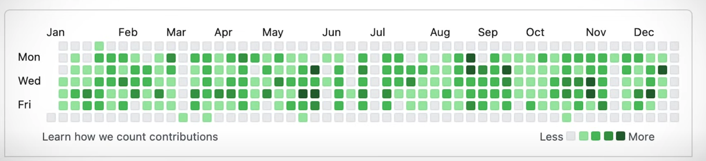

# 🧠 GitHub Activity Monitor Fix — Track Real Coding, Not Just Commits

## 📌 Problem :

The GitHub contribution graph is often misunderstood and misused. It counts contributions based only on:

- Commits to **non-forked** repositories
- Commits that are **merged into the default branch** (typically `main`)

This creates a skewed view of developer activity:

- Thoughtful PRs, careful reviews, or long-term planning only count as **one** contribution.
- Hasty, direct-to-main commits make the activity chart look great — but encourage poor engineering practices.

> ⚠️ The chart below is an example of **frequent but unplanned commits**, giving the illusion of productivity:



---

## ✅ Solution

This project aims to **accurately track real developer activity** — not just what's merged to `main`.

We build a separate `code-tracking` repository that:

- ✅ Monitors your actual repo every **30 minutes**
- ✅ Extracts meaningful changes (modified, new, deleted files)
- ✅ Summarizes those changes using **AWS Bedrock** (Claude-3 Haiku)
- ✅ Commits a `.md` file summarizing that 30-minute session to the tracking repo

You get a true history of all your meaningful contributions, regardless of whether you merge, squash, or draft.

## 🛠️ Installation

1. **Prerequisites**:
   - Python 3.8+
   - Git
   - AWS Account with Bedrock access

2. **Setup**:
   ```bash
   git clone https://github.com/genin6382/git-change-tracker.git
   cd git-change-tracker
   pip install -r requirements.txt
